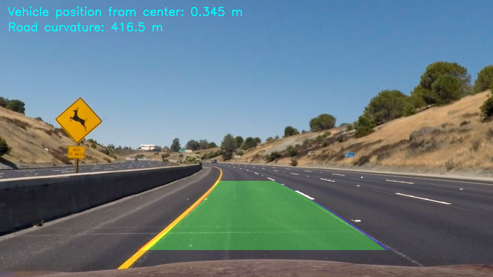

# AdvancedLaneLinesDetectionSDCN
Advanced algorithm for lane lines detection using OpenCV for Udacity Self Driving Car Nanodegree

### Overview
The repository contains the jupyter notebook implementing the pipeline for detecting lane lines on the road using the pictures and videos provided. The pipeline uses OpenCV functions to detect lines, and draws a green area between the detected lines on top of the image. 

An example picture is shown below. 

### Files and directories content
- `advanced_lane_finding_pipeline.ipynb` is a jupyter notebook containing all of the code. For more information on the pipeline, please check the `writeup.md` file. 
- The directory `camera_cal` contains images used for calibrating the camera 
- The directory `test_images` and the video `project_video.mp4` provide input images and video examples, respectively, for testing the pipeline
- The directory `output_images` contains the images created by the pipeline and used in `writeup.md`
- The video file `project_video_out.mp4` contain the output video generated by the pipeline. The video is the same as the ibput video `project_video.mp4`, but with the detected lane lines drawn on top of the video frames. 
- There are 4 more video files, two of which are input videos provided in the Udacity [repository](https://github.com/udacity/CarND-Advanced-Lane-Lines), namely `challenge_video.mp4` and `harder_challenge_video.mp4`. They show harder challenges than the `project_video.mp4` file. The corresponding output videos `challenge_video_output.mp4` and `harder_challenge_video_output.mp4` are discussed, and the issues identified are discussed at the bottom of the writeup document. 
- `writeup.md` provides more details on the processing pipeline

### How to run the code
To run the code, simply clone the repository, and run the command `jupyter notebook` from the directory containin the notebook _advanced_lane_finding_pipeline.ipynb_. All of the input data is provided. 

The code has been tested using:
- Python 3.6.3 under Anaconda3 and Windows 8.1
- OpenCV 3.3.1

### Known limitations and issues
- If you see the error `[WinError 6] The handle is invalid` appearing in the output cell of your notebook when running the video processing examples, restart jupyter and rerun the notebook. 
- The pipeline does not produce perfect results on the video, and the detected lane lines are wiggle a bit. This can be further improved by changing the pipeline to be more robust for different ligthing conditions and in the areas with shadows.
- The pipeline does not perform well on the chalenging videos, as discussed in the writeup document. 

### Where to find more information
- The file `writeup.md` provides more information on the processing pipeline
- OpenCV documentation and tutorials can be found on the [OpenCV website](https://opencv.org/)
- More information on the original assignment can be found in the original [github repository](https://github.com/udacity/CarND-Advanced-Lane-Lines)
