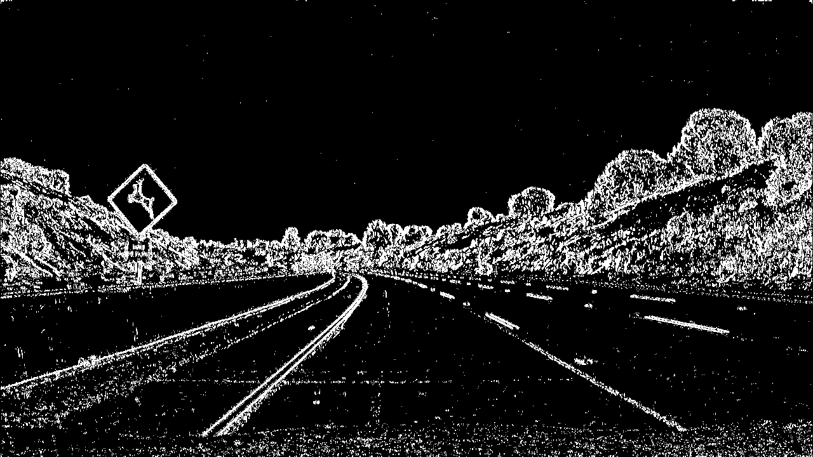
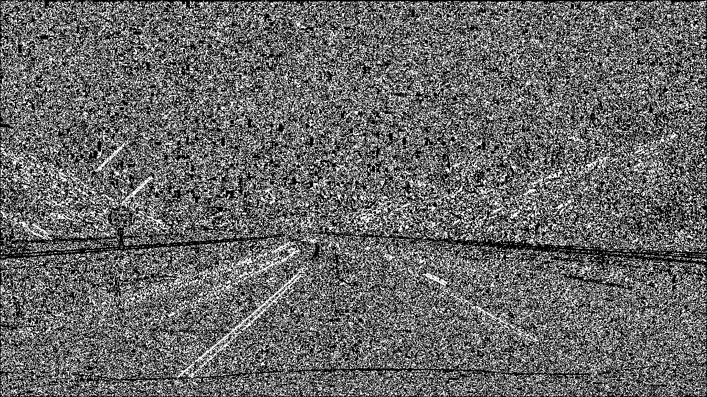
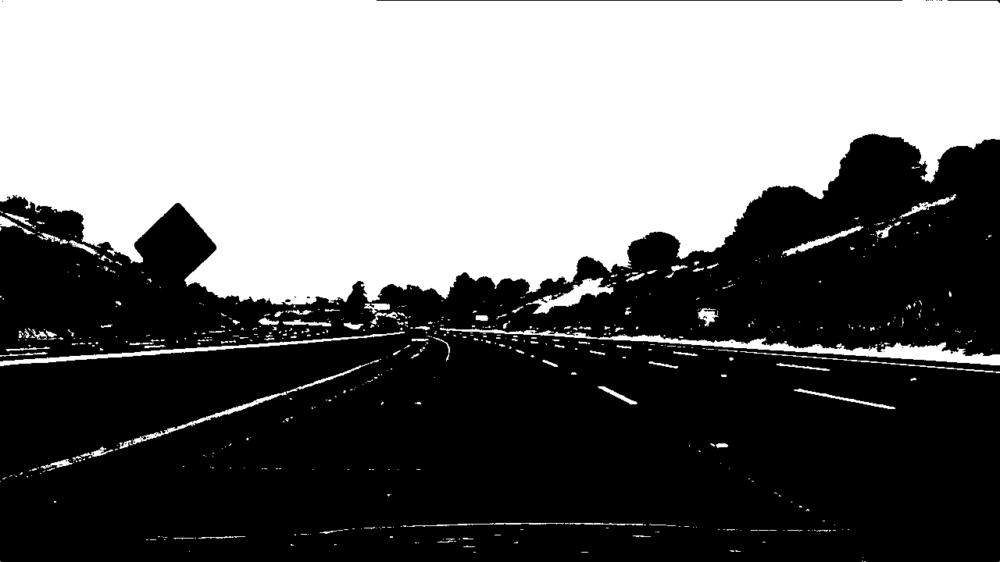
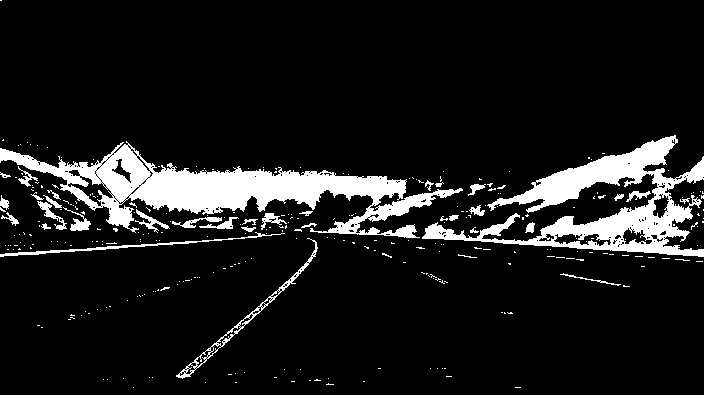
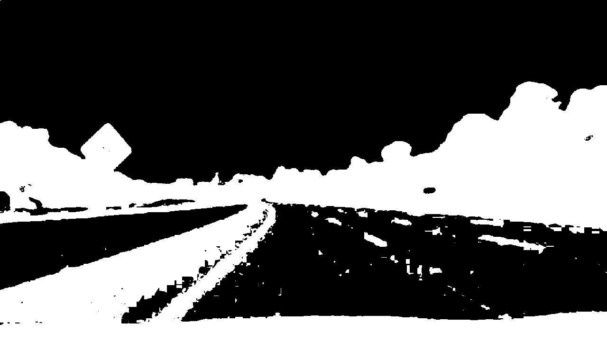
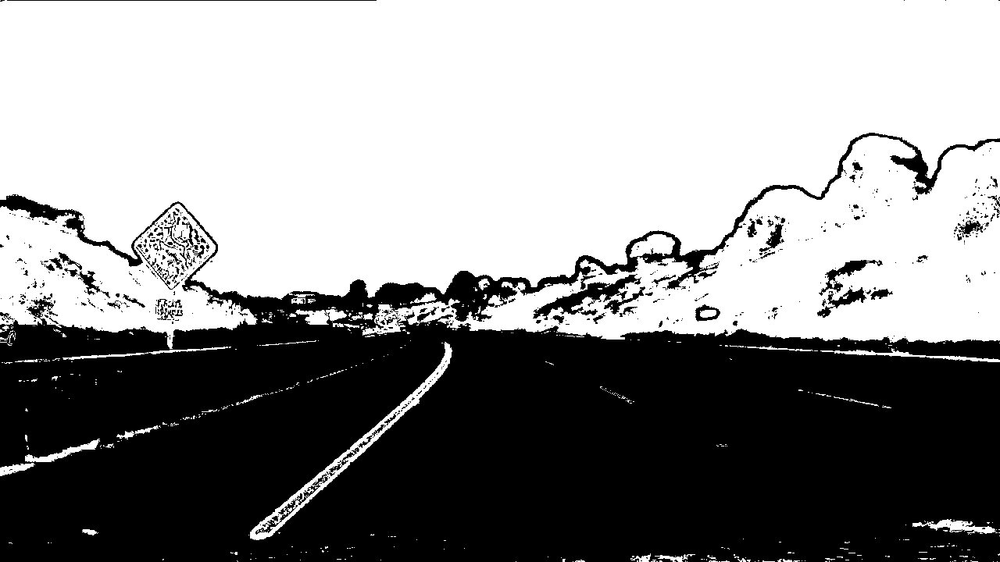
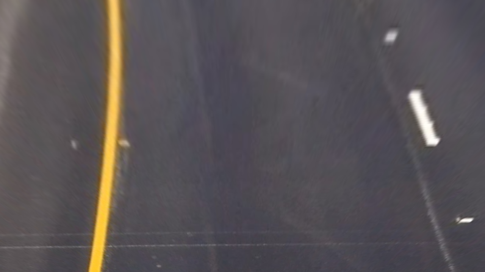

# **Advanced Lane Lines Detection Project**
## Writeup / README

This is a summary of the work done to develop a processing pipeline for the advanced lane lines detection project for the Udacity Self-Driving Car Nanodegree. The github repositroy of the project can be found [here](https://github.com/bmalnar/AdvancedLaneLinesDetectionSDCN)

The steps described in the following text include:

* Compute the camera calibration matrix and distortion coefficients given a set of chessboard images.
* Apply a distortion correction to raw images.
* Use color transforms, gradients, etc., to create a thresholded binary image.
* Apply a perspective transform to rectify binary image ("birds-eye view").
* Detect lane pixels and fit to find the lane boundary.
* Determine the curvature of the lane and vehicle position with respect to center.
* Warp the detected lane boundaries back onto the original image.
* Output visual display of the lane boundaries and numerical estimation of lane curvature and vehicle position.

### Camera Calibration

The code for camera calibration can be found in the jupyter notebook, cells 2 through 6. The method is based on the OpenCV functions for camera calibration, as described in the following text. 
The camera calibration images are provided in the Udacity repository for the project, and are stored in the directory called `camera_cal`. There are 20 images provided, and the goal is to use most of them (ideally all) for the calibration. The code does the following: 

1) Create `objpoints` and `imgpoints` arrays that will store the detected corners and the corresponding image points for all of the images. 
2) For each image, get the corners and the corresponding image points, and add those to the global arrays created in step 1. Some images have 9x6 corners and some have 9x5, so we have to make sure that we try both options with the function `cv2.findChessboardCorners`. There are two images that don't correspond to any of these 2 dimensions and they are ignored, so overall 18 images are used for calibration. 
3) Use the function `cv2.calibrateCamera` to calculate the camera matrix, distortion coefficients, and rotation and translation vectors, based on `objpoints` and `imgpoints`. The camera matrix and the distortion coefficients are later used in the image processing pipeline. 

To verify that the calibration produced good results, we can undistort one of the images from the camera_cal directory:


By running the command `cv2.undistort` to undistort the image, we get: 


### Development of image processing pipeline

In this section, the idea behind the image processing pipeline will described, together with the various steps to achieve the goal of drawing a green zone in the original image, between the detected lane lines. 

The pipeline is largely based on the Sobel operator for detecting edges in the image. We can apply the Sobel operator separately on both x and y directions of the image, and then from the values of these operations we can calculate the overall magnitude of the gradient and the direction of the gradient. The idea is to use some combination of these gradients (only x, or combined x and y, or x gradient combined with the direction gradient, etc.) to come up with the pixels that represent the lane lines. Another area of investigation is whether to use Sobel on RGB images or HLS images. 

#### Test image

To validate the pipeline,w e use one of the images provided in the `test_images` directory, for example `test2.jpg`:


#### Sobel x and y gradients

In the notebook, there is a function called `abs_sobel_thresh`, which calculates the Sobel gradient either in x or in y direction. It firsts converts the image to grayscale, and then runs the function `cv2.Sobel`, where the kernel size can be specified as a function input. We get the following results. 

X gradient: 



Y gradient: 


We can see that we slightly prefer the x gradient for lanes detection, because even though both images show the lines detected, the y gradient has more "noise", i.e. more detections that we don't care about.   

#### Sobel magnitude and direction of the gradient

If we combine x and y gradients, we can calculate the overall magnitude of the gradient and its direction, which can help us filter out only the pixels that belong to lane lines. 

We calculate the magnitude of the gradient with the function `mag_thresh`, which calculates x and y gradients and then returns the square root of the sum of their squares. We threshold the output to create the binary version that we want, as shown in the following picture:


We calculate the direction of the gradient by calculating arctan of the ratio of `abs(grad_y)/abs(grad_x)`. The resulting gradient is between 0 and pi, but we can filter a sub-section of that (e.g. between 0.7 and 1.3) to detect the lanes. The result is shown in the following picture:



If we combine the magnitude and the direction of the gradient, we essentially get the pixels that have a certain magnitude and at the same time a certain direction, which helps to detect the lanes by ignoring the pixels that either have a magnitude which is to low, or the have a direction that we are not interested in. The following picture shows the result of that combination, and we can see that we get a similar image as with the gradient magnitude, but the lines that are for example horizontal are thrown away. 


#### Color space

We investigated the RGB and HLS color spaces for the pipeline, as well as the grayscale. For that purpose, there are several functions in the notebook to easily transform the input image into these various formats and channels, e.g. `get_rgb_binary, get_rgb, get_hls_binary, get_hls, get_gray_binary`. As described in the Udacity course material and as shown by various experiments, the HLS color space seems to be the most adequate for the purpose of lane detection, because it is the most robust one in terms of shades, light intensity etc. For example, with the grayscale format sometimes that yellow lane line completely blands with the gray asphalt and cannot be recognized. 

The following figures show how we transform the image to R, G, B, H, L, and S binary representation. In this particular case, the differences are not intuitive enough to show that one format is better than the other, but the experiments have shown that H and L binaries provide the most robust solution and are therefore used in the pipeline. 

R binary:



G binary:


B binary:



H binary:



L binary:


S binary:



#### Edge detection pipeline

Based on the methods above to calculate the magnitude and the direction of the gradient using the Sobel operator, and based on different color spaces and channels, we developed the following set of functions to detect the lane lines. The function `pipeline` is implemented in the notebook implements these processing steps:

1) Convert the input image to the HLS color space and get the L and S channels
2) Calculate the gradient in x direction on both L and S channels
3) Using the S channel, calculate the direction of the gradient
4) Calculate the thresholded values of the S channel
4) Combine the x gradient of L and S with the direction of the gradient and with the thresholded S channel to get the final result (see the function in the notebook for more details)

Using this method on the following picture:


we obtain the following result:


The last image is what we refer to as the *binary image* in the further text. Through all the frames of the project video, this method has proven to be stable and generates good results. 

#### Perspective transform

After detecting the pixels belonging to the lane lines, we need to transform the image to a different perspective, i.e. so that we view the road top-down. We do this by specifying the points in the image that we want to transform, and their desired destination points, denoted in the notebook as _src_ and _dst_, respectively. We then use the OpenCV function `cv2.getPerspectiveTransform` to calculate the transform matrix and its inverse (_M_ and _M_inv_, respectively), which we can use to transform the original image to the top-down (using _M_) view and vice versa (using _M_inv_). 

At this point, we can transform the original and the binary images to the top-down view. The following two images show the results of these operations:




The code for my perspective transform includes a function called `warper()`, which appears in lines 1 through 8 in the file `example.py` (output_images/examples/example.py) (or, for example, in the 3rd code cell of the IPython notebook).  The `warper()` function takes as inputs an image (`img`), as well as source (`src`) and destination (`dst`) points.  I chose the hardcode the source and destination points in the following manner:

```python
src = np.float32(
    [[(img_size[0] / 2) - 55, img_size[1] / 2 + 100],
    [((img_size[0] / 6) - 10), img_size[1]],
    [(img_size[0] * 5 / 6) + 60, img_size[1]],
    [(img_size[0] / 2 + 55), img_size[1] / 2 + 100]])
dst = np.float32(
    [[(img_size[0] / 4), 0],
    [(img_size[0] / 4), img_size[1]],
    [(img_size[0] * 3 / 4), img_size[1]],
    [(img_size[0] * 3 / 4), 0]])
```

This resulted in the following source and destination points:

| Source        | Destination   | 
|:-------------:|:-------------:| 
| 585, 460      | 320, 0        | 
| 203, 720      | 320, 720      |
| 1127, 720     | 960, 720      |
| 695, 460      | 960, 0        |

I verified that my perspective transform was working as expected by drawing the `src` and `dst` points onto a test image and its warped counterpart to verify that the lines appear parallel in the warped image.

![alt text][image4]

#### 4. Describe how (and identify where in your code) you identified lane-line pixels and fit their positions with a polynomial?

Then I did some other stuff and fit my lane lines with a 2nd order polynomial kinda like this:

![alt text][image5]

#### 5. Describe how (and identify where in your code) you calculated the radius of curvature of the lane and the position of the vehicle with respect to center.

I did this in lines # through # in my code in `my_other_file.py`

#### 6. Provide an example image of your result plotted back down onto the road such that the lane area is identified clearly.

I implemented this step in lines # through # in my code in `yet_another_file.py` in the function `map_lane()`.  Here is an example of my result on a test image:

![alt text][image6]

---

### Pipeline (video)

#### 1. Provide a link to your final video output.  Your pipeline should perform reasonably well on the entire project video (wobbly lines are ok but no catastrophic failures that would cause the car to drive off the road!).

Here's a [link to my video result](./project_video.mp4)

---

### Discussion

#### 1. Briefly discuss any problems / issues you faced in your implementation of this project.  Where will your pipeline likely fail?  What could you do to make it more robust?

Here I'll talk about the approach I took, what techniques I used, what worked and why, where the pipeline might fail and how I might improve it if I were going to pursue this project further.  
